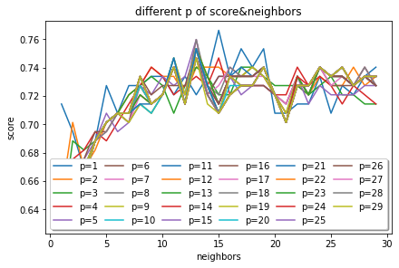
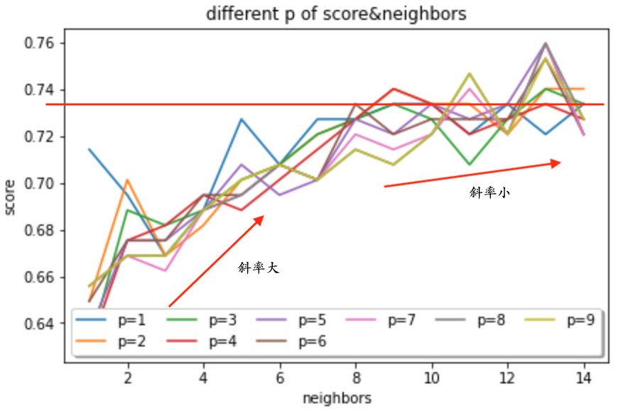
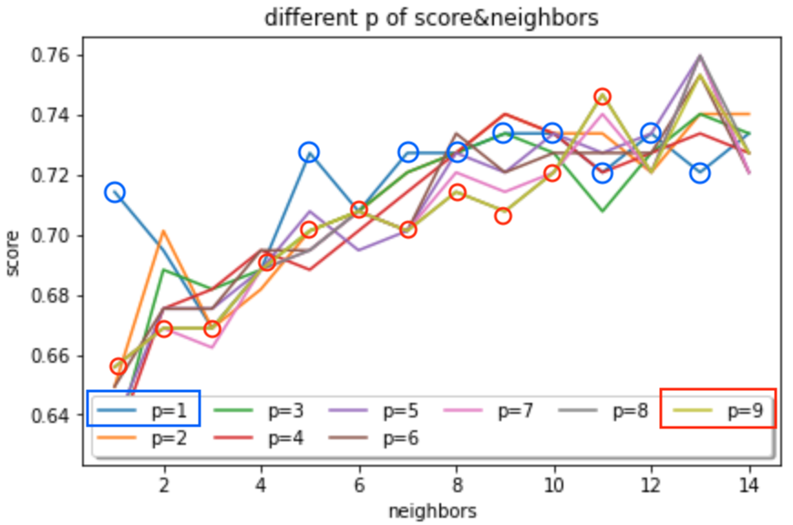

KNN
========

## Analyze different of parameters




* The bigger Neighbors we choose, the more accurate we got.
* If Neighbors is small. choosing larger Minkowski distance's p will decrease the accuracy.

## Implementaion of KNN using Tensorflow
[code](knn.ipynb)
### Usage
1. declare a KNN Model: `knn = TF_KNeighborsClassifier()`
   parameters
   * n_neighbors: (default:3), The number of neighbors
   * p: (default:2) the p of [Minkowski distance](https://en.wikipedia.org/wiki/Minkowski_distance)
2. Fit KNN: `knn.fit(x_train,y_train)`
3. Predict: `y_pred = knn.predict(x_test)`
4. Scoring: `knn.score(X_test=x_test,y_test=y_test)`

### Algorithm
1. Load the data
2. Initialize K to your chosen number of neighbors
3. For each example in the data
   1.  Calculate the distance between the query example and the current example from the data.
   2. Add the distance and the index of the example to an ordered collection
4. Sort the ordered collection of distances and indices from smallest to largest (in ascending order) by the distances
5. Pick the first K entries from the sorted collection
6. Get the labels of the selected K entries
7. If regression, return the mean of the K labels
8. If classification, return the mode of the K labels

### Example
```python
from knn import TF_KNeighborsClassifier

knn = TF_KNeighborsClassifier()
y_pred = knn.predict(x_test)
print(y_pred)
```
