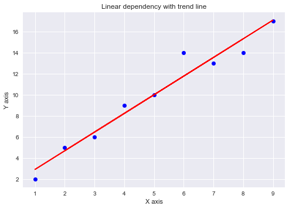

Linear Regression
========

## Implementaion of Simple Linear Regression using Tensorflow
[code](simple_LR.ipynb)
### Usage
1. declare a KNN Model: `model = TF_SimpleLinearRegression()`
2. Fit KNN: `model.fit(x_train,y_train)`
3. Predict: `y_pred = model.predict(x_test)`
4. score(mse):`model.score(X_test = x, y_test=y)`

### Algorithm
y = ax+b
### Example
```python
from slr-1d import TF_SimpleLinearRegression

model = TF_SimpleLinearRegression()
model.fit(x,y)
y_pred = model.predict(x)
print(y_pred)
model.score(X_test = x, y_test=y)

```

